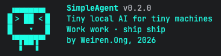

# SimpleAgent



**SimpleAgent** is a lightweight local AI coding agent built around a simple idea: small models can become useful when the surrounding system gives them strong structure, good context, safe patching, and human-in-the-loop review.

> Work work. Ship ship. Poor man's Claude Code for tiny local models.

SimpleAgent is designed for local Ollama models such as `nemotron-3-nano:4b`, with a focus on practical code editing, workflow orchestration, file attachments, and safe patch application inside a terminal UI.

---

## Table of Contents

- [Designing for Small Local Models](#designing-for-small-local-models)
  - [1. Small Models Need Procedures, Not Vibes](#1-small-models-need-procedures-not-vibes)
  - [2. Split Reasoning from Patch Generation](#2-split-reasoning-from-patch-generation)
  - [3. Use Raw Stored Output, Pretty Display Only for Humans](#3-use-raw-stored-output-pretty-display-only-for-humans)
  - [4. File Context Must Be Explicit and Refreshable](#4-file-context-must-be-explicit-and-refreshable)
  - [5. Patch Application Must Be Conservative](#5-patch-application-must-be-conservative)
  - [6. Let the Diff Decide What Is Safe](#6-let-the-diff-decide-what-is-safe)
  - [7. Make Parser Recovery Practical](#7-make-parser-recovery-practical)
  - [8. Keep Humans in the Loop](#8-keep-humans-in-the-loop)
  - [9. Prefer Local, Inspectable Workflows](#9-prefer-local-inspectable-workflows)
- [What SimpleAgent Does](#what-simpleagent-does)
- [Core Features](#core-features)
- [Coding Workflow](#coding-workflow)
- [Persona System](#persona-system)
- [Workflow System](#workflow-system)
- [Patch Review and Apply System](#patch-review-and-apply-system)
- [Attachment and Web Context System](#attachment-and-web-context-system)
- [Terminal UX](#terminal-ux)
- [Commands](#commands)
- [Keybindings](#keybindings)
- [Installation](#installation)
- [Requirements](#requirements)
- [Recommended Models](#recommended-models)
- [Configuration](#configuration)
- [Project Structure](#project-structure)
- [Example Coding Flow](#example-coding-flow)
- [Why This Project Matters](#why-this-project-matters)
- [Roadmap](#roadmap)
- [Contributing](#contributing)
- [License](#license)
- [Contact](#contact)

---

## Designing for Small Local Models

SimpleAgent was built around a practical discovery: a 4B local model may struggle as a freeform software engineer, but it can still perform useful code editing when the environment reduces ambiguity.

The project therefore focuses less on making the model magically smarter and more on building a system that compensates for small-model weaknesses.

Small models often fail in predictable ways:

- They understand the task but output malformed patches.
- They produce correct code but wrap it in unusable formatting.
- They forget exact whitespace, which breaks Python patches.
- They create widgets but forget framework-specific layout calls.
- They output partial code while pretending it is the entire file.
- They follow one instruction well but degrade when too many goals are mixed together.

SimpleAgent's design is a response to those failure modes.

### 1. Small Models Need Procedures, Not Vibes

Small models perform better when instructions are written as strict procedures instead of broad requests.

Instead of asking:

```text
Use SEARCH/REPLACE format.
```

SimpleAgent workflows can instruct the model step by step:

```text
Output the file name first.
For every block, output exactly:
<<<<<<< SEARCH
exact existing line(s) from the attached file, preserving whitespace
=======
replacement line(s), preserving required whitespace
>>>>>>> REPLACE
```

This matters because small models often behave better when given an execution recipe:

1. print the filename,
2. print the opening marker,
3. copy exact existing code,
4. print the divider,
5. output replacement code,
6. print the closing marker.

The model is not asked to infer a format. It is asked to follow a sequence.

### 2. Split Reasoning from Patch Generation

One major design decision is to separate planning from final edit generation.

A typical coding workflow can run multiple prompts:

```text
Prompt 1: draft a rough implementation plan.
Prompt 2: generate the actual code patch using the plan.
Prompt 3: optionally review or reconstruct the solution.
```

This is useful because small models often fail when asked to reason, plan, code, preserve whitespace, and format a patch all in one response.

SimpleAgent workflows allow each prompt to have a narrower job:

| Step | Purpose |
|---|---|
| Plan | Understand the change and identify the target code area |
| Draft patch | Produce rough edit intent, even if imperfect |
| Final patch | Generate structured code output using the previous context |
| Review | Check or rebuild the answer into a cleaner final form |

This makes the model more reliable without needing a larger model.

### 3. Use Raw Stored Output, Pretty Display Only for Humans

The terminal can render model replies with markdown formatting, code boxes, colours, and diff highlighting. However, `/code` does not parse the rendered terminal output.

SimpleAgent follows this rule:

```text
Store raw model output.
Render pretty output for humans.
Parse the raw stored output for edits.
```

This prevents UI formatting from corrupting patch markers such as:

```text
<<<<<<< SEARCH
=======
>>>>>>> REPLACE
```

The `/markup` command can toggle pretty formatting on or off, but `/code` still sees the raw assistant reply.

### 4. File Context Must Be Explicit and Refreshable

Small models need clear file context. SimpleAgent uses `/attach` to load files into the conversation and embed their contents for retrieval.

When an attached file changes after `/code` applies an edit, SimpleAgent refreshes the attachment context before the next prompt. This is critical for iterative coding because the model must see the latest file, not stale context.

Design goals:

- Attach the exact file the user wants edited.
- Prefer current attachment content over vague conversation history.
- Refresh changed attachments automatically.
- Allow `/workflow-debug` to inspect the actual prompt messages sent.

### 5. Patch Application Must Be Conservative

Small models can generate dangerous edits. A model may output only one function inside a fenced code block, while the parser may initially treat it as a whole-file replacement.

That can produce a diff that appears to delete most of the file.

SimpleAgent therefore does not blindly apply model output. It always shows a review screen before writing files.

The `/code` flow is:

```text
Model output
→ parse possible edits
→ generate diff
→ classify safe and risky regions
→ user reviews
→ F2 or F3 applies
```

### 6. Let the Diff Decide What Is Safe

One of SimpleAgent's most important design ideas is using the diff itself as a safety signal.

If the model outputs partial code that is surrounded by unchanged code, those unchanged lines act as safety bounds. Changes inside those bounds are likely intentional.

If the diff shows large unbounded deletions at the top or bottom of the file, those regions are risky.

SimpleAgent supports a safe/risky apply model:

| Key | Behaviour |
|---|---|
| `F2` | Apply only safe bounded changes |
| `F3` | Apply all changes, including risky highlighted regions |
| `Esc` | Cancel without changing files |

Risky diff regions are rendered in dark yellow where supported.

This allows SimpleAgent to recover useful edits from imperfect model output. Instead of rejecting the entire response or applying a destructive patch, it can apply only the parts that are structurally safe.

### 7. Make Parser Recovery Practical

Small models do not always produce perfect Aider-style patches.

SimpleAgent therefore supports multiple edit formats:

| Format | Purpose |
|---|---|
| SEARCH/REPLACE | Precise Aider-style edits |
| Whole-file fenced code | Replace an entire file when appropriate |
| Partial fenced code | Recover function/class-level updates |
| Unified diff | Apply standard diff output |
| Context-only diff-like output | Recover useful intent from incomplete diff output |

The parser also normalises noisy filename lines such as:

```text
hello.py
File: hello.py
File name: hello.py
File name:** hello.py
**File name:** `hello.py`
a/hello.py
b/hello.py
```

This matters because small models often produce path labels with markdown artefacts.

### 8. Keep Humans in the Loop

SimpleAgent is not designed to silently rewrite a project. It is designed to make a small model useful while keeping the developer in control.

The human reviews the diff before applying. The tool makes the model productive, but does not pretend the model is always correct.

This is especially important for local models because code quality can vary depending on prompt structure, temperature, context, and task complexity.

### 9. Prefer Local, Inspectable Workflows

SimpleAgent workflows are plain markdown files. They are easy to edit, inspect, and version.

A workflow can define steps like:

```md
prompt_start: "plan"
print: "Summoning the tiny intern to scribble a rough battle plan."
add_persona_context
add_attachment_context
add_original_user_prompt
prompt: "plan"
prompt_end

prompt_start: "coding"
print: "Handing the crayons to the serious robot now. Generating the proper solution."
add_persona_context
add_attachment_context
add_prompt_output: "plan"
add_original_user_prompt
add_user_prompt: "Output the file name first..."
prompt: "output"
prompt_end
```

This keeps the agent behaviour transparent. The model is not hidden behind a black-box orchestration framework.

---

## What SimpleAgent Does

SimpleAgent TUI is a terminal-based local AI assistant for:

- chatting with Ollama models,
- attaching project files as context,
- running multi-step prompt workflows,
- generating code edits,
- reviewing diffs before applying changes,
- experimenting with small-model coding workflows.

It is especially focused on making small local models useful for controlled software development tasks.

---

## Core Features

- **Local Ollama chat interface** for small and medium local models.
- **Persona system** for switching between general and coding behaviour.
- **Workflow engine** for multi-prompt agent flows.
- **File attachments** with embedded context retrieval.
- **Automatic attachment refresh** when attached files change.
- **Code editing mode** with `/code` review and apply.
- **SEARCH/REPLACE patch support** for Aider-style edits.
- **Whole-file and partial-file recovery** from fenced code blocks.
- **Unified diff parsing** for standard patch output.
- **Safe/risky diff application** with F2/F3 controls.
- **Pretty TUI rendering** with markdown, code blocks, tables, and diff colouring.
- **Raw output mode** for parser debugging.
- **Slash command completion** with `/attach` file path autocomplete.
- **Conversation memory and retrieval** using embeddings.
- **Web context loading** for URL/search-based context.

---

## Coding Workflow

The coding workflow is designed around small-model reliability.

A typical coding flow looks like this:

1. Attach a file.
2. Ask for a small code change.
3. Workflow prompt 1 creates a rough plan.
4. Workflow prompt 2 generates patch output.
5. `/code` parses the last assistant reply.
6. SimpleAgent shows a diff.
7. User presses `F2`, `F3`, or `Esc`.

Example:

```bash
/attach hello.py
edit hello.py to add a quit button
/code
```

The model output may contain SEARCH/REPLACE blocks:

```text
hello.py
<<<<<<< SEARCH
old code
=======
new code
>>>>>>> REPLACE
```

SimpleAgent parses the raw response, generates a diff, and asks for confirmation before applying it.

---

## Persona System

Personas are SimpleAgent's lightweight way to change both the model's behaviour and the workflow that runs for a given task.

A persona provides **system context**. This is the high-level instruction block that tells the model how it should behave, what style it should use, and what constraints it should follow.

For example, a coding persona can tell the model to:

- act as a software engineer,
- be concise and action-oriented,
- avoid inventing file contents or tool results,
- preserve the user's intent,
- prefer structured code-edit output,
- follow small-model-friendly patch instructions.

This matters because small models are highly sensitive to framing. A clear persona gives the model stable behaviour before the workflow adds task-specific instructions.

### Personas as Workflow Switches

Personas also act as an easy way to switch workflows.

Instead of manually choosing a workflow for every request, SimpleAgent can map a persona to a workflow. This allows different modes of operation:

| Persona | Example Workflow | Purpose |
|---|---|---|
| `default` | General chat workflow | Normal conversation and lightweight assistance |
| `coding` | Plan → patch workflow | File-aware code editing with `/code` support |
| `review` | Review-only workflow | Inspect code without applying changes |
| `debug` | Error analysis workflow | Analyse logs/errors and propose fixes |

This design keeps the user experience simple:

```text
Switch persona → get different system context + different workflow behaviour.

---

## Workflow System

Workflows are markdown files stored in either the project workflows directory or the user workflows directory.

They are intentionally simple and readable.

### Workflow Commands

| Command | Purpose |
|---|---|
| `prompt_start: "name"` | Begin a prompt block |
| `prompt_end` | End a prompt block |
| `add_persona_context` | Add current persona/system prompt |
| `add_recent_messages` | Add recent chat messages |
| `add_memory_context` | Add relevant memory context |
| `add_attachment_context` | Add relevant attached file context |
| `add_web_context` | Add relevant web context |
| `add_original_user_prompt` | Add the user's original prompt |
| `add_to_original_user_prompt: "..."` | Append text to the original user prompt |
| `add_system_context: "..."` | Add literal system context |
| `add_user_prompt: "..."` | Add literal user instruction |
| `add_prompt_output: "name"` | Add output from a previous prompt block |
| `print: "..."` | Print workflow status text to the interface |
| `prompt: "output_name"` | Run the model and store output under a name |

### Multiline Workflow Strings

Workflow commands can use multiline quoted strings:

```md
add_user_prompt: "
Output the file name first.
Then output SEARCH/REPLACE blocks.
Preserve whitespace.
"
```

This is useful for detailed procedural instructions.

### Workflow Debugging

Use:

```bash
/workflow-debug
```

to inspect the exact prompt messages sent during the last workflow run.

This is important when tuning prompts for small models because you need to see what the model actually received.

---

## Patch Review and Apply System

The `/code` command attempts to parse the last assistant reply into file edits.

Supported edit styles include:

### SEARCH/REPLACE Blocks

```text
hello.py
<<<<<<< SEARCH
old code
=======
new code
>>>>>>> REPLACE
```

### Whole-File Fenced Code

```text
hello.py
```python
full file content
```
```

### Partial Fenced Code

```text
hello.py
```python
def updated_function():
    ...
```
```

### Unified Diff

```diff
--- a/hello.py
+++ b/hello.py
@@ -1,3 +1,4 @@
 old line
+new line
```

### Safe vs Risky Application

SimpleAgent classifies changes using unchanged diff lines as safety bounds.

| Key | Action |
|---|---|
| `F2` | Apply safe bounded changes only |
| `F3` | Apply all proposed changes |
| `Esc` | Cancel |

This allows the user to accept useful edits from imperfect model output without applying obviously risky deletions.

---

## Attachment and Web Context System

SimpleAgent treats local files and web pages as first-class context sources. Both `/attach` and `/web` are designed to give small local models more grounded information before they answer or generate code.

### File Attachments

Files can be attached with:

```bash
/attach path/to/file.py
```

Attached files are:

- read from disk,
- split into smaller text chunks,
- embedded using the configured embedding model,
- stored in an in-session vector index,
- retrieved as relevant context during prompts,
- refreshed when changed by `/code`.

### Chunking and Embeddings

SimpleAgent uses `langchain_text_splitters` to break larger files into manageable chunks before embedding them. This keeps the context system useful even when files are too large to send fully into every prompt.

The basic flow is:

```text
attached file
→ read text
→ split into chunks with langchain_text_splitters
→ generate embeddings with the configured Ollama embedding model
→ store chunks in the attachment vector index
→ retrieve relevant chunks when building the model prompt
```

This is especially important for small models because they benefit from precise context instead of noisy full-project dumps. The model receives the most relevant chunks for the user's request, while full attachment context can still be included where appropriate for smaller files.

The embedding model is configurable. A code-aware embedding model such as `ordis/jina-embeddings-v2-base-code:latest` is recommended because SimpleAgent often needs to retrieve function definitions, nearby code, and implementation details.

### Attach Autocomplete

Typing:

```bash
/attach 
```

opens prompt-toolkit completions for files in the current workspace.

Current-directory files are prioritised before subdirectory files. Files ignored by `.gitignore` are skipped.

### Web Context

The `/web` command can be used with either a direct URL or a search query:

```bash
/web https://example.com/article
/web latest ollama structured output examples
```

When given a URL, SimpleAgent fetches and extracts the page content. When given a search query, SimpleAgent uses DuckDuckGo search to find relevant pages, scrape useful information, and add it as web context.

Web context follows a similar pattern to file attachments:

```text
URL or DuckDuckGo query
→ fetch/search web content
→ extract readable text
→ split content into chunks
→ embed chunks with the configured embedding model
→ store chunks in the web context index
→ retrieve relevant chunks when building the prompt
```

This lets `/web` serve the same role as `/attach`, but for external information. The model can use scraped web context as grounded reference material instead of relying only on its internal training data.

In short:

| Source | Command | Purpose |
|---|---|---|
| Local files | `/attach` | Give the model project/code/document context |
| Direct web pages | `/web <url>` | Add a specific page as context |
| Web search | `/web <query>` | Use DuckDuckGo to find and scrape relevant context |

---

## Terminal UX

SimpleAgent is built as a terminal-first tool.

UX features include:

- slash command suggestions,
- file path autocomplete for `/attach`,
- loading messages between workflow prompts,
- formatted markdown output,
- diff code blocks with colour,
- `/markup` toggle for raw output,
- `Esc` to cancel command/apply states,
- `F2` and `F3` apply modes for code edits.

The TUI aims to make local model experimentation fast and inspectable.

---

## Commands

| Command | Description |
|---|---|
| `/attach <path...>` | Attach supported files by path |
| `/web <url or search query>` | Load URL/search context |
| `/paste` | Paste text or image from clipboard |
| `/clear` | Clear session history, memory, attachments, web context, and workflow debug |
| `/code` | Review/apply edits from the last assistant reply |
| `/model <name>` | Show or change the Ollama chat model |
| `/embedding <name>` | Show or change the embedding model |
| `/vision <name>` | Show or change the vision model |
| `/models` | List installed Ollama models |
| `/select-model` | Select and persist an installed chat model |
| `/select-embedding` | Select and persist an installed embedding model |
| `/persona` | Open persona manager |
| `/workflow` | Show workflow help |
| `/workflow-install <path>` | Install a workflow markdown file |
| `/workflow-debug` | Print prompt messages from last workflow run |
| `/markup` | Toggle markdown-style rendering for agent replies |
| `/history` | Show session history |
| `/about` | Show app info |
| `/version` | Show version |
| `/help` | Show help menu |
| `/exit`, `/quit`, `/q` | Exit app |

---

## Keybindings

| Key                | Action |
|--------------------|---|
| `/`                | Open slash command suggestions |
| `Enter`            | Submit input or accept selected completion |
| `Esc`              | Clear active slash command or cancel apply dialog |
| `Esc` then `Enter` | Insert newline fallback where needed |
| `F1`               | Toggle thinking display |
| `F2`               | Apply safe bounded code changes in `/code` review |
| `F3`               | Apply all changes in `/code` review |

---

## Installation

1. Clone this repository:

```bash
git clone <your-repo-url>
cd SimpleAgentTUI
```

2. Install Python dependencies:

```bash
pip install -r requirements.txt
```

3. Install and run Ollama:

```bash
ollama serve
```

4. Pull recommended models:

```bash
ollama pull nemotron-3-nano:4b
ollama pull ordis/jina-embeddings-v2-base-code:latest
ollama pull granite3.2-vision:2b
```

5. Start SimpleAgent:

```bash
python main.py
```

---

## Requirements

- Python 3.10+
- Ollama running locally
- A local chat model, such as `nemotron-3-nano:4b`
- An embedding model, such as `ordis/jina-embeddings-v2-base-code:latest`
- Optional vision model for image attachments

---

## Recommended Models

SimpleAgent was built and tested around small local models.

| Role | Suggested Model |
|---|---|
| General chat and coding workflows | `nemotron-3-nano:4b` |
| Embeddings | `ordis/jina-embeddings-v2-base-code:latest` |
| Vision | `granite3.2-vision:2b` |
| Alternative coding model | Qwen Coder / DeepSeek Coder local variants |

Nemotron is especially interesting because it can follow step-by-step procedural prompts well, which makes it suitable for structured local workflows.
The inference speed for Nemotron is also very fast making the user experience better.

---

## Configuration

Configuration is saved to:

```text
~/.simpleagent/config.json
```

Common configuration values include:

- selected chat model,
- embedding model,
- vision model,
- personas,
- persona-to-workflow mapping,
- markup formatting preference.

User workflows are stored in:

```text
~/.simpleagent/workflows
```

Runtime attachments are stored under:

```text
~/.simpleagent/attachments
```

---

## Project Structure

High-level files:

| File | Purpose |
|---|---|
| `main.py` | TUI application, command handling, prompt flow |
| `editblock.py` | `/code` parsing, diff generation, patch application |
| `formatter.py` | Terminal markdown/code/diff rendering |
| `ollama.py` | Lightweight Ollama client |
| `utils.py` | Attachment reading, chunking, embeddings, retrieval helpers |
| `workflows/` | Markdown workflow definitions |

---

## Example Coding Flow

```bash
/attach hello.py
edit hello.py so the quit button closes the app
/code
```

SimpleAgent may run a workflow like:

```text
Summoning the tiny intern to scribble a rough battle plan.
Handing the crayons to the serious robot now. Generating the proper solution.
```

Then it shows a diff:

```diff
--- a/hello.py
+++ b/hello.py
@@ -1,3 +1,3 @@
-quit_btn = tk.Button(root, text="Quit", command=quit_app)
+quit_btn = tk.Button(root, text="Quit", command=root.destroy)
```

Then the user chooses:

- `F2` to apply safe changes,
- `F3` to apply all changes,
- `Esc` to cancel.

---

## Why This Project Matters

SimpleAgent is a practical experiment in making small local models useful.

Instead of assuming only frontier models can perform code editing, the project explores what happens when a small model is paired with:

- explicit procedural prompting,
- multi-step workflows,
- file attachments,
- retrieval,
- conservative patch parsing,
- safe diff review,
- human approval.

This makes the project relevant to:

- local-first AI tooling,
- low-resource agent design,
- developer productivity tools,
- prompt orchestration,
- coding assistant UX,
- AI safety for file-editing agents.

The goal is not to beat large commercial coding agents. The goal is to show that careful systems design can make tiny local models surprisingly useful.

---

## Contributing

Contributions are welcome. Good areas to help with:

- parser robustness,
- workflow examples,
- model benchmarking,
- syntax/lint integrations,
- terminal UX improvements,
- documentation.

Please open an issue or submit a pull request.

---

## License

MIT

---

## Contact

For questions, feedback, or collaboration, please open an issue in this repository.